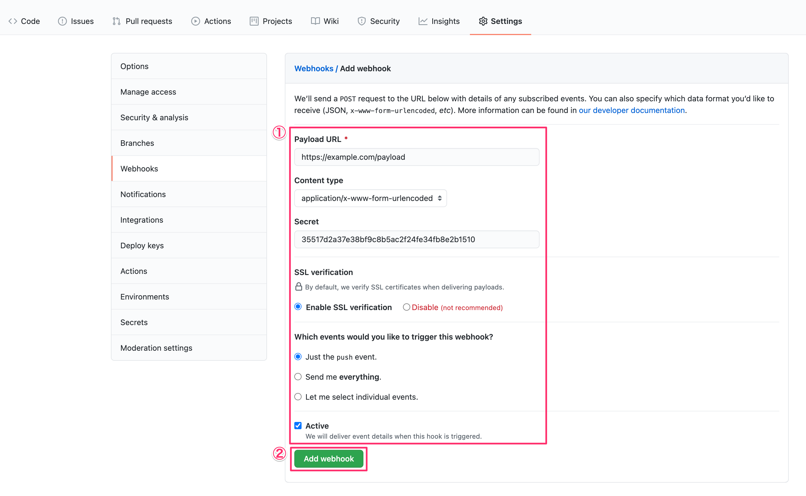
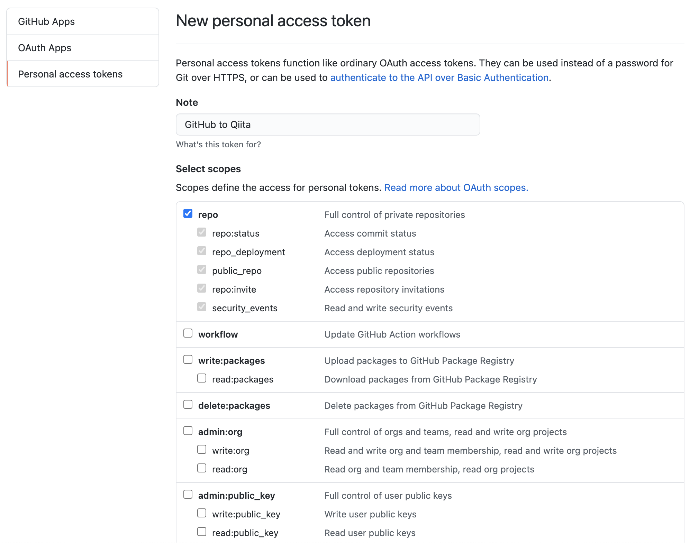
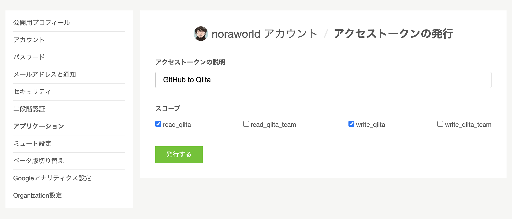

# GitHub-to-Qiita
Pushing development articles into the specific repository, they will be published to [Qiita](https://qiita.com) via [Qiita API v2](https://qiita.com/api/v2/docs).

## Setup
### Add GitHub Webhooks
1. Visit `https://github.com/<GITHUB_USERNAME>/<GITHUB_REPOSITORY>/settings/hooks/new`
2. Fill in the mandatory information
3. Click `Add webhook` button


| Item | Description | Example | Note |
|---|---|---|---|
| Payload URL | Your URL that can receive GitHub Webhooks | `https://example.com/payload` | The path must be `/payload` |
| Content type | Select `application/x-www-form-urlencoded` | | |
| Secret | The random string | `35517d2a37e38bf9c8b5ac2f24fe34fb8e2b1510` | This token must not be known by other people |
| SSL verification | Select `Enable SSL verification` | | |
| Which events would you like to trigger this webhook? | Select `Just the push event.` | | |
| Active | Check | | |

**TIPS**: You can generate the random string for `Secret` by `ruby -rsecurerandom -e 'puts SecureRandom.hex(20)'` easily.

### Generate GitHub personal access token
1. Visit https://github.com/settings/tokens/new
2. Fill in the mandatory information
3. Click `Generate token` button
4. Copy generated token and save it to other place temporarily


| Item | Description | Example | Note |
|---|---|---|---|
| Note | Your access token’s name | `GitHub to Qiita` | |
| Select scopes | Check `repo` | | |

### Generate Qiita personal access token
1. Visit https://qiita.com/settings/tokens/new
2. Fill in the mandatory information
3. Click generate button
4. Copy generated token and save it to other place temporarily


| Item | Description | Example | Note |
|---|---|---|---|
| Description | Your access token’s name | `GitHub to Qiita` | |
| Scopes | Check `read_qiita` and `write_qiita` | | |

### Complete `.env`
1. Copy `.env.sample` to `.env` (Execute `cp .env.sample .env`)
2. Fill in the mandatory information
3. Save file `.env`

| Variable | Description | Example | Note |
|---|---|---|---|
| GITHUB_REPOS | Your developers blog repository name with username on GitHub | `noraworld/developers-blog-content` | |
| INCLUDED_DIR | Only the contents in the directory specified by this env will be tracked | `articles` | The trailing slash is unnecessary |
| QIITA_ACCESS_TOKEN | Your personal Qiita access token generated a moment ago | `777fb820e25847dd659266a66dcdd99580b4b85f` | This token must not be known by other people |
| GITHUB_WEBHOOK_SECRET_TOKEN | Your GitHub webhook secret token filled in on GitHub Webhooks settings page a moment ago | `35517d2a37e38bf9c8b5ac2f24fe34fb8e2b1510` | This token must not be known by other people |
| GITHUB_PERSONAL_ACCESS_TOKEN | Your GitHub personal access token generated a moment ago | `d77af6cff2dd13f58886f6eff890eea93e53bdc9` | This token must not be known by other people |

### Run the script
Run `main.rb` at the domain specified at `Payload URL` on GitHub Webhooks settings.

```shell
$ ruby main.rb
```

Daemonize this script if needed.
